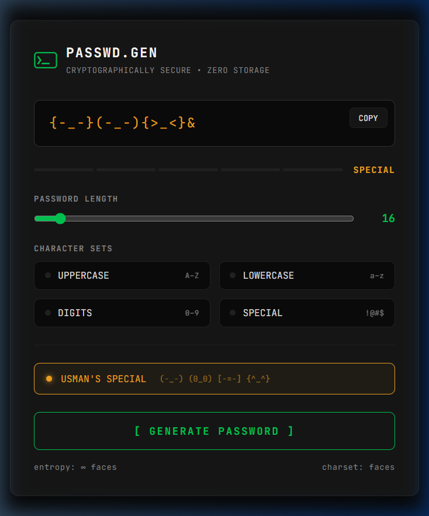

# 🔐 Passwd.Gen: Cryptographically Secure Password Generator

[](https://opensource.org/licenses/MIT)
[](https://developer.mozilla.org/en-US/docs/Web/Guide/HTML/HTML5)
[](https://developer.mozilla.org/en-US/docs/Web/CSS)
[](https://developer.mozilla.org/en-US/docs/Web/JavaScript)
[](https://www.jetbrains.com/lp/mono/)

A high-performance, strictly local, and cryptographically secure password generator designed with a premium "hacker" aesthetic. Built for speed, security, and visual elegance.

---

## 🌟 Visual Preview



---

## 🔥 Key Features

-   **🔒 Cryptographically Secure**: Uses `window.crypto.getRandomValues()` for industrial-grade randomness.
-   **⚡ Zero Storage**: No data ever leaves your browser. No databases, no tracking, just pure logic.
-   **🎨 Premium UI**: Dynamic dark mode with glassmorphism effects and **JetBrains Mono** typography.
-   **🎭 Usman's Special**: A unique generation mode using ASCII art faces and emoticons for memorable yet complex "pattern" passwords.
-   **📊 Entropy Visualization**: Real-time bit-entropy calculation and strength classification (WEAK to ELITE).
-   **📋 One-Click Copy**: Seamless clipboard integration with interactive feedback.

---

## 🛠️ Technology Stack

-   **Structure**: Semantic HTML5 for accessibility and SEO.
-   **Logic**: Vanilla JavaScript (ES6+) with the Web Crypto API.
-   **Styling**: Pure CSS3 with a custom CSS variable-based design system.
-   **Typography**: JetBrains Mono via Google Fonts.

---

## 🚀 Getting Started

### Prerequisites

No installation required! Just a modern web browser (Chrome, Firefox, Edge, Safari).

### Usage

1.  Clone or download this repository.
2.  Open `index.html` in your browser.
3.  Adjust the **length** and **character sets** to your preference.
4.  Hit **[ GENERATE PASSWORD ]**.
5.  Click **COPY** to use your new secure password.

---

## 👔 Project Structure

```text
Password-Generator/
├── index.html   # Application Structure
├── style.css    # Design System & Premium UI
├── script.js    # Generation Logic & Crypto API
└── preview.png  # UI Screenshot
```

---

## 🤝 Contributing

Contributions, issues, and feature requests are welcome! Feel free to check the [issues page](https://github.com/usaihack/Portfolio/issues).

## 📜 License

Distributed under the MIT License. See `LICENSE` for more information.

---

*Built with precision for the security-conscious.*
